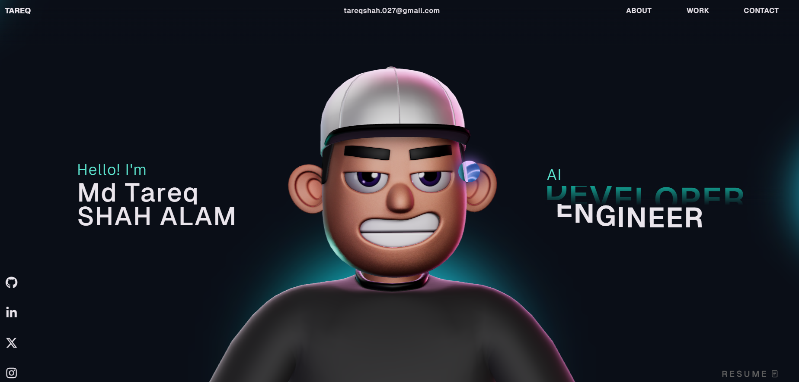

# Md Tareq Shah Alam - Portfolio Website 🚀

This repository contains the open source version of my portfolio website.
Feel free to explore the code and check out the live version below.

🔗 **Live Portfolio:** https://tareqshahalam.netlify.app/

---

## Instructions 🛠️

This project uses GSAP animations. Note that GSAP Club plugins are not supported for deployment when using trial versions. For proper usage and production setup, refer to: https://gsap.com/docs/v3/Installation/

---

## Tech Stack 💻

* React
* TypeScript
* GSAP
* Three.js
* WebGL
* HTML
* CSS
* JavaScript

---

## Preview 📸

---

## License

This project is open source and available under the [MIT License](LICENSE).
